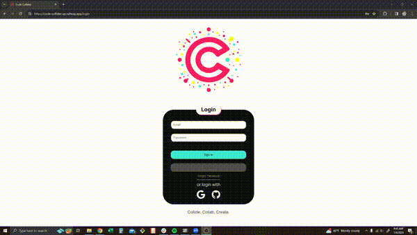
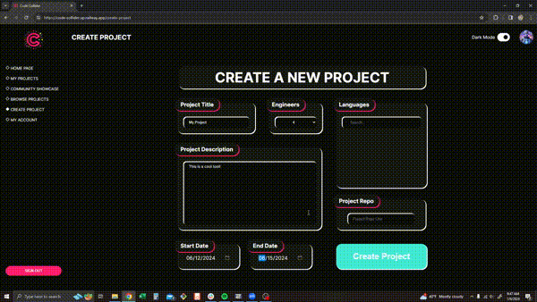
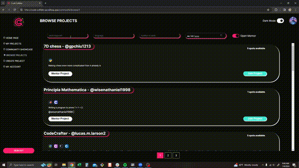
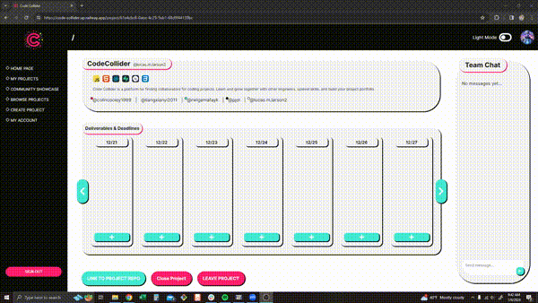
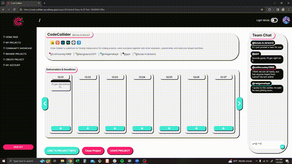
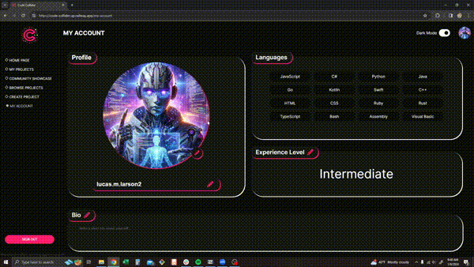

<a id='readme-top'> </a>

<br />
<div align="center">
  <a href="https://github.com/Team-Demon-Slayer/code-collider">
    <!--  -->
  </a>
  <h3 align="center">
    Code Collider
  </h3>
  <p align="center">
    <br />
    <a href="https://github.com/Team-Demon-Slayer/code-collider"><strong>Explore the docs »</strong></a>
    <br />
  </p>
</div>

<details>
  <summary>Table of Contents</summary>
  <ol>
    <li>
      <a href="#about">About</a>
      <ul>
        <li>
          <a href="#built-with">Built With</a>
        </li>
      </ul>
    </li>
    <li>
      <a href="#getting-started">Getting Started</a>
      <ul>
        <li>
          <a href="#prerequisites">Prerequisites</a>
        </li>
        <li>
          <a href="#installation">Installation</a>
        </li>
      </ul>
    </li>
    <li>
      <a href="#usage">Usage</a>
    </li>
    <li>
      <a href="#roadmap">Roadmap</a>
    </li>
    <li>
      <a href="#optimizations">Optimizations</a>
    </li>
    <li>
      <a href="#contributing">Contributing</a>
    </li>
    <li>
      <a href="#contact">Contact</a>
    </li>
  </ol>
</details>

## About

<div align="center">
  <h3>Login and Home</h3>
  
<br />
    <h3>Create Project</h3>
  
</div>
<br />
    <h3>Browse Projects</h3>
  
</div>
<br />
    <h3>Project Page</h3>
  
  
</div>
<br />
    <h3>My Account</h3>
  
</div>

<br />
<p>
  Code Collider is a secure collaberation platform where developers of all skill levels can work together on group projects and recieve mentoring from senior developers.
</p>

### Built With


<p align="right">
  (<a href="#readme-top">back to top</a>)
</p>

## Getting Started

<p>
    Instructions to setup Code Collider on your local machine below.
</p>

### Prerequisites


```sh
npm install npm@latest -g
```

### Installation

1. Clone the repo
   ```sh
   git clone https://github.com/Team-Demon-Slayer/code-collider.git
   ```
2. Install NPM packages
   ```sh
   npm install
   ```
3. Enter your port, API URL, and Github Token in `.env.local` file
   ```sh
    NEXT_PUBLIC_SUPABASE_URL = (your supabase database URL)
    NEXT_PUBLIC_SUPABASE_ANON_KEY = (your supabase token)
   ```
4. Run in dev environment.
   ```sh
   npm run dev
   ```

## Usage

Code Collider is run on the designated port. It can also be accessed utilizing localhost:PORT directly in the browser.

Run linter: `npm run lint `

<p align="right">(<a href="#readme-top">back to top</a>)</p>

<!-- ROADMAP -->

## Roadmap

- [x] Secure Eamil/GitHub/GMail signup/login
- [x] Create new group project form
- [x] Implement current and past project filter/browse functionality
- [x] Integrate quick access to user's current active project
- [x] Inovate a real-time team chat, deliverables and deadlines tracker, and online user presence project page
- [x] Developed a my account page for user details

<p align="right">(<a href="#readme-top">back to top</a>)</p>

## Optimizations

1.  Reduction in query times leveraging the RDMBS structure of supabase generating 94% performance, 93% accessibility and 90% SEO ratings from lighthouse
1.  Modernized the user experience optional light and dark mode settings
1.  Refined the ease of use for user with real-time team interactions

<!-- CONTRIBUTING -->

## Contributing

Feel free to join in! Whether its fixing bugs, improving documentation, or
simply spreading the word!

<!-- CONTACT -->

## Contact

<h3 align='center'> Luke</h3>
<h4 align='center'>
  <a href="https://www.linkedin.com/in/lucas-m-larson/">Linkedin</a> |
  <a href="https://github.com/LukeLarson2">GitHub</a>
</h4>
<h3 align='center'> PJ</h3>
<h4 align='center'>
  <a href="https://www.linkedin.com/in/pjol/">Linkedin</a> |
  <a href="https://github.com/pjol">GitHub</a>
</h4>
<h3 align='center'> Xianyi</h3>
<h4 align='center'>
  <a href="https://www.linkedin.com/in/xianyi-liang/">Linkedin</a> |
  <a href="https://github.com/LanceLiang2011">GitHub</a>
</h4>
<h3 align='center'> Faycal</h3>
<h4 align='center'>
  <a href="www.linkedin.com/in/faycalkarasirwigema-swe">Linkedin</a> |
  <a href="https://github.com/1Oulala">GitHub</a>
</h4>
<h3 align='center'> Nathaniel</h3>
<h4 align='center'>
  <a href="www.linkedin.com/in/nathaniel-wise1/">Linkedin</a> |
  <a href="https://github.com/Gralayer">GitHub</a>
</h4>
<h3 align='center'> Gordon</h3>
<h4 align='center'>
  <a href="https://www.linkedin.com/in/gordon-chiu/">Linkedin</a> |
  <a href="https://github.com/gordon1213">GitHub</a>
</h4>
<h3 align='center'> Colin</h3>
<h4 align='center'>
  <a href="https://www.linkedin.com/in/colin-cooley/">Linkedin</a> |
  <a href="https://github.com/colincooley">GitHub</a>
</h4>
<h3 align='center'> Yuxin</h3>
<h4 align='center'>
  <a href="https://www.linkedin.com/in/yuxin-lu-ja/">Linkedin</a> |
  <a href="https://github.com/yuxinlu1">GitHub</a>
</h4>

<p align="right">(<a href="#readme-top">back to top</a>)</p>
